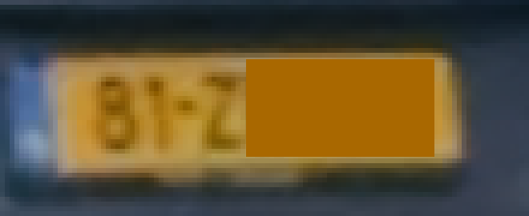
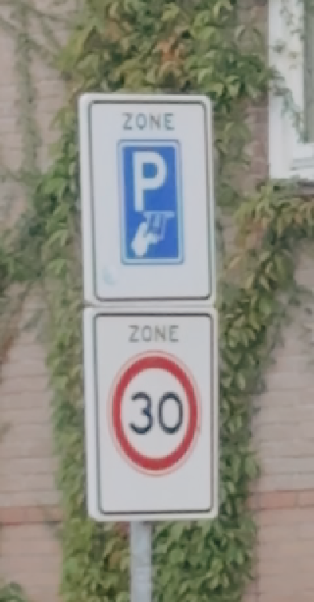
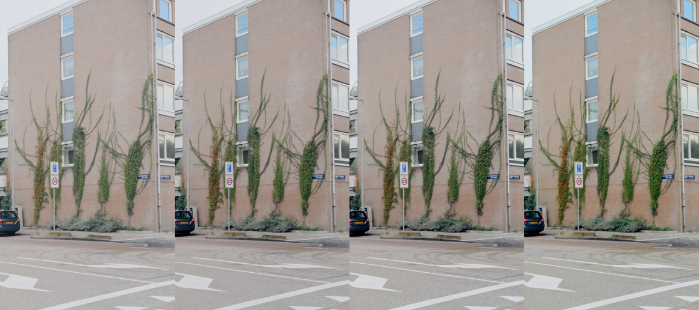
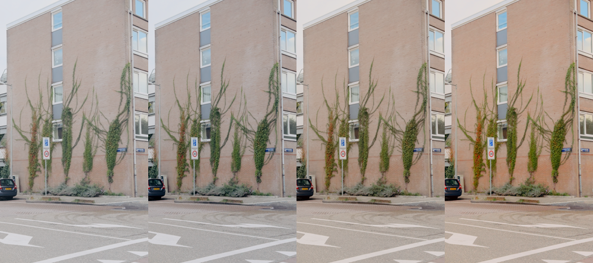

# Grading pipeline — rationale, decisions, findings

The four decisions in here that a later reader is most likely to "fix" are also written up short
in `docs/adr/`: grade by tone and not by colour (0001), keep Apple's CST over the filmic route
(0002), tone on luma only (0003), one clip's intermediates on disk (0004). The measurements behind
them stay here. `CONTEXT.md` is the vocabulary.

## Goal

Cinematic-looking Instagram posts (Reels/Stories, 9:16) from iPhone ProRes 422 HQ / Apple Log
source, 4K24, locked stabilization. Consistent look across posts (Kodak Portra emulation).
Working clip: IMG_0609.mov — the test clip the whole recipe was developed against before
being run across the rest of the shoot.

## Naming convention

`<original-filename-stem>_<stage>.<ext>`. Never rename the original iPhone filename stem
(IMG_0609 etc.) — it's the join key back to `src/` and to the phone's own capture order.

A final is named for its **deliverable**, not for being final: `<clip>_reels-stories_9x16.mp4` and
`<clip>_feed_4x5.mp4`. **README.md carries the folder tree** and is the only copy of it; this file
used to carry a second one, which drifted and then had a paragraph underneath explaining that the
tree above it was wrong. `CONTEXT.md` carries which word means what.

## Pipeline stages

### 1. Baseline (`01-baseline/`)

Purely technical, zero creative judgment:

- **No rotation.** This stage applies no rotation and accepts no rotation argument; the single
  guard lives in the delivery stage. `docs/adr/0005_ORIENTATION_IS_AN_INGEST_CONCERN.md` carries
  why, what it cost to learn, and what the guard actually measures, and is the only copy of it.
- **Apple Log → Rec.709.** Apple's own 65³ LUT (`luts/apple/AppleLogToRec709-v1.0.cube`), not a
  hand-rolled curve — the log transfer function is proprietary and ffmpeg has no built-in support
  for it. `interp=tetrahedral` (more accurate than trilinear, worth the extra render time on a
  one-shot baseline pass).
- **Color tags.** `prores_ks` does NOT reliably stamp `-color_primaries`/`-color_trc`/`-colorspace`
  flags set at encode time — found by ffprobe still showing `bt2020`/`unknown` on a file whose
  actual pixels were already correctly transformed to Rec.709. Any player/app that trusts the
  container tag (QuickTime, Resolve) then reinterprets already-correct Rec.709 values as if they
  were still BT.2020, double-transforming the image — this is what "bleached out" was. Fix: a
  fast `-c copy` remux pass immediately after encoding, setting the tags then — remuxing (not
  re-encoding) reliably writes them. **Always verify with `ffprobe -show_entries
  stream=color_space,color_transfer,color_primaries` after every encode of this pipeline** —
  don't assume flags passed to an encoder landed. First found on `prores_ks`, it recurred on
  `libx264` too: assume every encoder in this pipeline needs the post-encode verification, not
  just the ProRes stages.
- **White balance.** Checked, not assumed: sampled the road (a real neutral reference in this
  shot) at full resolution → R174.0 G176.2 B176.7, within ~1.5% — effectively neutral, no
  correction applied. (An earlier visual read off a downscaled thumbnail suggested a warm cast;
  that was wrong. Measure the actual pixels before correcting anything — a small preview can lie.)
  Capture used **locked** WB and focus (confirmed) — so unlike auto WB, this should
  hold consistent across every clip in the shoot rather than drifting per-scene. IMG_0609's
  near-neutral reading is therefore a reasonable baseline expectation for the rest of the shoot too,
  though still worth a spot-check on one or two (a locked value can still read differently under
  a lighting change the lock doesn't compensate for) rather than trusting it blind on all of them.
- **No sharpening, no noise reduction, no saturation push at this stage.** Log footage *looks*
  soft because the log curve compresses contrast, not because the sensor capture is soft — once
  the CST restores contrast, apparent sharpness returns on its own. Sharpening before the
  creative grade bakes in halos that compound with whatever comes next and are much harder to
  undo than to add later.

### Diagnosing "too bright" (Portra pass, v1 → v2)

The graded output was flagged as too bright despite correct in-phone exposure — worth ruling
out a real pipeline bug before touching the grade. Checked, in order:

- **Color range mismatch** (a common cause of exactly this symptom — limited/full range confusion
  inflates brightness). Ruled out: `color_range=tv` tagged consistently source → baseline →
  graded, and actual pixel values (YMIN 236, YMAX 854 on the 10-bit source) sit correctly inside
  TV-legal bounds (64–940) — not evidence of mistagged full-range data.
- **Where in the pipeline the brightness actually changes**: same frame, before/after the Portra
  LUT —

  | | YMIN | YAVG | YMAX (10-bit, 0–1023) |
  |---|---|---|---|
  | Baseline (post-CST) | 150 | 609 | 884 |
  | Graded v1 (post-Portra, LUT at 100%) | 147 | **666** | 856 |

  Highlights didn't clip further (max went *down*, 884→856) and the black floor barely moved
  (150→147) — so it isn't a technical defect (no clipping, tags correct, range correct). It's the
  Portra LUT's own character: Kodak Portra's signature is soft, lifted shadows rather than punchy
  digital blacks. Applied at full strength on top of already-correct Rec.709 footage, that shadow
  lift reads as an overall brightness/wash increase.

**Fix (v2), the way a colorist would rather than diluting the whole LUT**: keep the Portra LUT at
full strength — its highlight/midtone color character was already correct — and add a second,
targeted correction after it that pulls down only the lifted shadow region.

First attempt, wrong: `curves=master='0/0 0.12/0.08 0.35/0.30 0.6/0.6 1/1'` (5 points, converging
back to identity by 0.6 so mids/highlights stay untouched). Measured result: YAVG went from 666
(LUT alone) to **670** — brighter, not darker. Cause: ffmpeg's `curves` filter interpolates
control points with a natural cubic spline, not straight lines between them — a 5-point shape
with uneven slope between segments (steep rise from 0.35→0.6, then flat to 1.0) overshoots
*above* identity in the upper-mid range to keep the spline smooth, and that's exactly where most
of the LUT-graded frame's pixel mass now sits. Caught by measuring YAVG after the fix, not by
assuming the filter did what the control points implied — worth remembering for any future
`curves` use in this pipeline.

Fix: fewer points, one bend only — `curves=master='0/0 0.2/0.15 1/1'`. Verified monotonic (no
overshoot) by testing several 3-point variants and confirming YAVG moved in the expected direction
for each. Final result: YAVG 622.6 — a modest lift above the true baseline (609, natural and
expected from grading) without the excessive shadow brightening the 5-point curve produced.

A blanket global LUT-opacity blend (also standard/valid — Resolve's node Key/Blend, Premiere
Lumetri's Intensity slider) was the faster option throughout but weakens color everywhere, not
just where the problem was; went with the targeted curve since accuracy mattered more than speed.

### 2. Graded master (`02-graded/`)

Baseline + creative look, still ProRes (no quality loss from delivery compression yet). This is
the file to reopen for any future re-export — never re-grade starting from a compressed
Instagram export.

**Recipe at this point in the work** — superseded, kept for the measurements below. "Tone shaping"
further down replaces the `curves` stage with a generated 1D LUT applied to luma only, and
`scripts/02-grade.sh` is what actually ships. (See "Calibrating against standardised colours
in frame" for how this one was derived.)

```
lut3d=file='kodak_portra_400_nc.cube':interp=tetrahedral,curves=master='0.14/0 0.65/0.47 1/0.90'
```

Measured result on IMG_0609: YMIN 62 (true black), YAVG 517.6, YMAX 745, blue sign B/G **1.97**
against a 1.98 spec. Brick R150 G139 B133 — mid-tone brown, matching map references of the real
building.

Two deliberate choices worth not "fixing":

- **No colour correction.** Measured, not assumed — every adjustment tried moved the standardised
  in-frame references off spec.
- **Highlights roll off to YMAX 745 rather than reaching white.** Tested against 4-point curves
  that recover YMAX to 892/934; both dragged YAVG back up (517→561→621) toward the washed-out
  look being fixed, because the extra control points reintroduce spline bulge. A held-back
  highlight is also on-character: film shoulders highlights off rather than clipping to
  paper-white, which is the point of a Portra emulation.

Residual, accepted: plate yellow G/R measures 0.69 against the RAL 1021 target of 0.80 (it is
0.76 at baseline, 0.73 after the Portra LUT, 0.69 after the tone curve). Chasing it distorts the
blue, which is currently near-exact — and the plate is small, shaded, soft and heavily
compressed, so some of that gap is measurement noise. Not worth over-fitting one reference at the
expense of another.

- **Look LUT**: `luts/looks/kodak_portra_400_nc.cube` — Kodak Portra 400 negative-film emulation,
  built from real film response data (G'MIC film emulation project), sourced from
  github.com/YahiaAngelo/Film-Luts. Chosen over a paid/gated LUT since this is start of a new
  consistent look (no pre-existing Portra LUT from past posts to match).
- Same tag-verification step as baseline — `prores_ks` needs the post-encode remux every time,
  not just once.

### 3. Final delivery encode (`03-final/`)

- **Downscale 2160×3840 → 1080×1920** with **Lanczos** — sharpest of the common resampling
  algorithms, matters because this is the one lossy resize in the whole pipeline.
- **Grain AFTER downscale, not before.** Grain sized for a 4K frame gets crushed/invisible once
  scaled to 1080p — doing it in source order silently wastes the step. Luma-only: chroma noise
  reads as colour speckle, not film grain.

  Superseded since this was written. The per-pixel noise described here does not survive
  delivery — the compressor smears it into blobs — and it must also come after the sharpener,
  which rings it. What ships is a half-resolution grey plate blended in, which keeps its structure
  through the re-encode and costs ~22% less bitrate. The measurements are in `scripts/lib.sh`
  above `grain_plate`, which is where the filter is now built.
- **Sharpen AFTER downscale** — mild, corrective (compensating for the softening the resize
  itself causes), not a stylistic push. Luma only.
- **Encode**: H.264 High Profile, yuv420p (dithered down from the master's 10-bit, not
  truncated), CRF 18, AAC 192k, `+faststart`. Instagram recompresses everything it receives
  regardless — feeding it high quality just means less of what it does have to throw away.
  Same color-tag verification as every other stage.

## Mistakes made (kept here so they don't repeat)

- **Never chain a command that can fail into an unconditional `mv`.** Twice in this pipeline a
  `mv` ran straight after an `ffmpeg` call with no exit-status check — once when a killed
  background rotation job's script continued past the dead process (caught before damage), and
  once for real: a `-map 0` remux failed (an mp4 container can't hold the ProRes source's
  timecode data track), producing a 0-byte file, and the very next line moved that 0-byte file
  over a finished 170MB export, destroying it. Recovery only worked because the ProRes master one
  stage back was untouched. Every script in this pipeline now checks `[ -s "$OUT" ]` (or the
  command's exit code) before any `mv` that would overwrite a prior result.
- **`-map 0` copies every stream, including ones the target container can't hold.** The ProRes
  `.mov` masters carry a QuickTime timecode data track; mp4 has no slot for it. Remuxing a mov
  into mp4 (or re-tagging one) needs explicit `-map 0:v:0 -map 0:a:0`, not a blanket `-map 0`.
- **ffmpeg's `curves` filter interpolates with a cubic spline, not straight lines between
  control points**, so a shape with more than ~3 points and uneven slope can overshoot past
  identity somewhere you didn't intend. Measure the actual result after any `curves` change;
  the control points don't predict it. Measured under "Diagnosing 'too bright'" above.
- **The hardening scripts themselves shipped with two bugs — both found only by running them.**
  (a) macOS ships **bash 3.2**, where expanding an *empty* array (`"${arr[@]}"`) under `set -u`
  raises "unbound variable". `safe_retag` took optional trailing args as an array, so every call
  without extra args died — silently blocking the very retag the function exists to perform, and
  leaving a freshly encoded master untagged. Fixed by passing `"$@"` straight through, which
  expands to nothing safely on 3.2. (b) `verify_bt709` compared ffprobe's output against a single
  expected line, which a file from this camera can never match — see "ffprobe lies about these
  files" below for the mechanism and the fix. It would have reported failure on every correctly
  tagged file once (a) was fixed. Lesson: a safety check that has never actually run is not a safety check — exercise each
  one against both a passing and a failing input before trusting it.
- **The Rec.709 tag bug isn't ProRes-specific.** First found on `prores_ks`, it recurred on
  `libx264` too — assume every encoder in this pipeline needs the post-encode tag verification,
  not just the ProRes stages.

## Calibrating against standardised colours in frame

The breakthrough on this shoot. Rather than grading by eye (unreliable — see the log of wrong
visual calls below), **calibrate against objects in the frame whose colour is legally
standardised**. This shot happens to contain three:

| Reference | Standard | Approx sRGB | Where |
|---|---|---|---|
| Dutch licence plate yellow | **RAL 1021** Colza yellow | R243 G195 B0 | Volvo, bottom-left (`crop=90:30:78:2743`) |
| Dutch traffic-sign blue | **RAL 5017** Traffic blue | R6 G57 B113 | parking "P" sign (`crop=50:90:655:2040`) |
| Dutch traffic-sign red | **RAL 3020** Traffic red | R204 G6 B5 | 30 km/h ring (`crop=62:95:650:2200`) |

All three are **in shade** here, so absolute values will read darker/cooler than spec. Use them as
**hue and ratio** references (G/R, B/G, channel purity), not absolute exposure references.

The crops themselves, as measured:

|  |  |
|---|---|
| RAL 1021 on the Volvo | RAL 5017 and RAL 3020 on the parking and 30 km/h signs |

And the two independent checks on what the building's colour actually is, used in "A theory this
disproved" below: Apple Maps (sunny) and Google Street View (overcast), of the same corner. Both
are third-party imagery that may not be redistributed, so they are not committed —
`reference-maps-SOURCE.txt` gives the coordinates and headings to pull them up again.

### What they proved

Tracing the plate through the pipeline (G/R, target 0.80):

| stage | G/R | B/R |
|---|---|---|
| source (Apple Log) | 1.01 | 0.99 — neutral, log carries almost no chroma |
| **baseline (post-CST)** | **0.76** | 0.33 |
| graded (post-Portra) | 0.73 | 0.20 |

**The Apple CST already lands the colour nearly correct.** And the blue sign, with *no* colour
correction applied, measures **B/G 1.99 against a 1.98 spec** — essentially exact.

Every colour "correction" attempted moved the standardised references further OFF spec:

- Saturation boosts (`hue=s=1.45`+) drove plate G/R 0.73 → 0.51 (yellow turning orange) and made
  the traffic red read "neon" — the artefact was visible before it was measured.
- Blue reduction to "restore golden hour warmth" moved blue B/G 1.99 → 1.90, away from spec.

**Conclusion: the colour was never broken. The tone was.** The footage reads flat/milky because
it sits ~25% too bright with nothing reaching black — not because of any colour error. The whole
fix is one tone curve, and the grade script now carries an explicit warning against "fixing" the
colour.

### A theory this disproved

Earlier reasoning in this document held that the locked white balance cancelled the golden-hour
warmth (road measuring slightly *cool* at 20:02 local), and that the grade should put the warmth
back. The standardised references disproved it: warming pushes the calibrated blue off spec. The
locked WB did neutralise the scene, but the resulting balance is *colorimetrically correct*.
Adding warmth is a legitimate **creative** choice — it is not a correctness fix, and it should be
applied knowing it trades measured accuracy for look.

### What the building actually looks like

Street View (overcast) and Apple Maps (sunny) of the same corner (Den Brielstraat) confirm the
building is **taupe/brown brick, not red brick** — so the source's very low chroma there
(SATMAX=6, see below) is the capture being accurate, not a pipeline failure. Worth checking a
map reference before concluding a grade has "lost" colour that was never there.

## Tone shaping: what actually makes it look graded

Calibrating to standardised colours got the image *accurate* and it still looked flat — accuracy
is not a grade. The remaining deficiency was tonal: no shadow density, no separation, everything
in a narrow band. Two approaches were built and measured.

The variant sweeps these conclusions came from, assembled by hand from `dist/ladders/`:

|  |  |  |
|---|---|---|
| tone curve steps | whole-look variants | warmth steps |

### Approach A — replace the CST entirely (`scripts/make-filmic-lut.py`)

The textbook-correct architecture: Apple Log → scene-linear (via Apple's own `AppleLogToLin`,
which is a **1D** 4096-entry LUT) → filmic tone curve applied *in linear* → Rec.709. Worth knowing:
Apple Log carries linear values to **12.0** (12× diffuse white, ~3.6 stops of headroom) and this
footage uses ~5.4× of it; the technical CST compresses all of that away.

It produced a better tone response — more density, and it used more of the range (YMAX 943 vs
745) — but **lost on colour** and was abandoned as the primary path:

- A 1D LUT cannot do it at all: log→linear is per-channel, but Apple Log is in **BT.2020
  primaries** and a 3×3 gamut matrix is not expressible as a per-channel curve. The first attempt
  ignored this and measured brick R78 G75 B74 (spread 4.6) versus 17.0 with the CST — badly
  under-saturated, because BT.2020 numbers read as Rec.709 desaturate.
- Adding the matrix (regenerating at 65³) only reached spread 8.6.
- Per-channel tone mapping desaturates by construction, so a global saturation multiplier was
  added to compensate — which then overshot the standardised blue to B/G 2.45 against a 1.98 spec.

**Apple's CST is better colour science than anything hand-rolled here**: it lands the blue at
1.97 *and* keeps more brick separation. The script is kept because the architecture is right and
it may be the better path with proper gamut mapping, but it is not what ships.

### Approach B — keep Apple's colour, shape the tone afterwards (`scripts/make-tone-lut.py`)

A filmic S-curve in display space, generated as a **1D LUT** and applied with `lut1d`. Generated
rather than using ffmpeg's `curves` because `curves` interpolates control points with a cubic
spline that overshoots past identity (this pipeline hit that twice — once producing an image
*brighter* than the uncorrected version). A 4096-entry 1D LUT is evaluated exactly.

Measured against the previous best (brick R−B 17.0, blue B/G 1.97, YAVG 518):

| | YAVG | YMAX | brick R−B | blue B/G |
|---|---|---|---|---|
| previous best | 518 | 745 | 17.0 | **1.97** |
| v_c (gentle) | 551 | 846 | 21.0 | 2.16 |
| v_b (middle) | 535 | 853 | 22.0 | 2.34 |
| v_a (strong) | 529 | 876 | 23.7 | 2.59 |

**The unavoidable trade: more contrast buys brick separation and costs colorimetric accuracy on
saturated objects.** A per-channel contrast curve crushes the two low channels of a saturated
colour harder than the high one, so saturated things get *more* saturated — the same mechanism as
the "neon" red. Removing the toe (`--toe 0`) moderates it substantially (blue 2.59 → 2.16 at
comparable contrast) and is why the shipped settings use no toe.

### The fix: apply the tone curve to LUMA ONLY

The saturation side-effect is not something to trade against — it can be removed. Apply the tone
curve to the luma plane and keep the original chroma:

```
[0:v]LOOKLUT,format=yuv444p10le,split=2[a][b];
[a]TONELUT,format=yuv444p10le[t];
[t][b]mergeplanes=0x001112:yuv444p10le[o]
```

`0x001112` = plane 0 from input 0 (the toned luma), planes 1 and 2 from input 1 (original chroma).

**`format=yuv444p10le` on both branches is required.** A first attempt without it failed with a
bare `Invalid argument`: `mergeplanes` needs matching plane dimensions, and the 4:2:2 source plus
`lut1d`'s internal RGB round-trip don't line up. The error names neither cause.

Measured, same tone LUT, per-channel vs luma-only:

| | YAVG | YMAX | brick R−B | blue B/G | red purity |
|---|---|---|---|---|---|
| per-channel | 534.8 | 853 | 22.0 | 2.34 | 0.29 (neon) |
| **luma-only** | 534.9 | 853 | 14.3 | **1.94** | **0.37** |

Identical tone; the standardised blue returns to spec (1.94 vs 1.98) and the red stops glowing.
The cost is that the brick gains no saturation either — preserving chroma preserves it for
everything, wanted or not.

**Do not try to win that back with a saturation boost.** Tested: `hue=s` 1.2→1.3 lifts brick R−B
from 14.3 to 18.7 but drags red purity 0.33→0.22, i.e. straight back to neon. A uniform
saturation multiplier amplifies whatever is already most saturated, which is exactly the
standardised signage.

**Also note:** darkening alone increases apparent saturation, because luma-only shaping lowers Y
while leaving CbCr untouched. Measured across gamma 1.85 / 1.95 / 2.05: red purity 0.33 / 0.30 /
0.27. So "darker" and "less neon" pull against each other and the gamma is the dial that trades
them.

### Two bugs worth not repeating

- **Contrast pivoted below the image's average brightens it.** Pivoting at 0.42 on footage
  averaging 0.65 pushed YAVG to 730–833 — most of the frame sits above the pivot, so "adding
  contrast" scaled it upward. The generator now has a `--gamma` stage applied *first* to bring the
  level down to the pivot; contrast then shapes rather than lifts.
- **`colorlevels` and `eq` are unusable here** (see below), so tonal work is `curves`/`lut1d` only.

## ffprobe lies about these files in three specific ways

The camera writes a `[STREAM_GROUP]` structure, and three ordinary ffprobe idioms break on it. All
three fail SILENTLY — no error, just a wrong answer. This section is the only copy; everything
else in these docs points here.

1. **`-select_streams a:0` returns nothing, on every clip, despite the audio being there.**
   Verified: the selector yields an empty result while an unfiltered query plainly shows
   `pcm_s16le,audio`. A silence check written the obvious way would report all 19 clips silent.
   Query without the selector and filter afterwards:
   ```bash
   ffprobe -v error -show_entries stream=codec_type,codec_name -of csv=p=0 FILE | grep audio
   ```
   **ffmpeg's `-map 0:a:0?` is unaffected** — stream selection for mapping and `-select_streams`
   for probing are different code paths. Checked the delivered finals: audio present throughout.
2. **`-select_streams v:0` prints the video stream TWICE** (once inside the stream group, once
   top-level) plus a blank line. Comparing that output to one expected line always fails — which
   is exactly how `verify_bt709` shipped broken. Take the first non-empty line.

3. **csv output carries a trailing comma** (`3840,2160,`), so `${dims##*,}` comes back empty and
   the numeric comparison that depends on it fails open. This is how the portrait guard shipped
   accepting landscape clips, and how `probe_tags` returned `bt709,bt709,bt709,` and left
   `verify_bt709` unable to pass on a camera-structured file however it was tagged. The comma
   appears on camera originals and on `-c copy` excerpts of them, but not on the pipeline's own
   re-encodes, so it stays hidden until real footage reaches it. Query one field at a time with
   `-of default=nw=1:nk=1` and validate the answer with a regex.

Rule for this footage: never trust a single-line ffprobe answer without checking what it actually
printed. All three cost real time and none announced itself.

## Measurement cookbook

Every claim in this document came from one of these. Reach for them before forming an opinion about
an image — several confident visual judgements made during this work turned out to be wrong, and
measurement is what caught them each time.

**Tonal stats (10-bit scale, 0–1023; tv-range black is 64, white 940):**

```bash
ffmpeg -i FILE -frames:v 1 -vf "signalstats,metadata=print" -f null - 2>&1 \
  | grep -E "YMIN=|YAVG=|YMAX=" | head -3
```

Add `crop=W:H:X:Y,` before `signalstats` to measure one region. `UAVG`/`VAVG` (512 = neutral) and
`SATAVG`/`SATMAX` come from the same filter and are how the brick was shown to be genuinely
near-colourless in the capture (SATMAX 6) rather than desaturated by the pipeline.

**Average RGB of a patch** — for colour ratios, where signalstats' YUV isn't what you want:

```bash
ffmpeg -y -i FILE -frames:v 1 -vf "crop=300:300:1500:600" -pix_fmt rgb24 -f rawvideo /tmp/p.raw
python3 -c "
d=open('/tmp/p.raw','rb').read(); n=len(d)//3
print('R %.1f G %.1f B %.1f'%(sum(d[0::3])/n,sum(d[1::3])/n,sum(d[2::3])/n))"
```

For a *saturated* reference (a sign, a plate) don't average the whole patch — it includes the white
background and black glyphs. Sort pixels by how much of the target hue they carry and average the
top 20–30%; the Grade Bench does the same thing, which is why its readings match these.

**Always verify the patch is where you think it is.** Crop it to a PNG and look at it before
trusting a number from it. One measurement here was nearly acted on before checking that the
"road" patch was actually road.

**Colour and range tags after every encode:**

```bash
ffprobe -v error -select_streams v:0 \
  -show_entries stream=color_space,color_transfer,color_primaries,color_range -of csv=p=0 FILE
```

Read "ffprobe lies about these files" below before scripting against this output. Both of the
guards that shipped broken did so by trusting it raw.

**Which pixel format a filter chain actually negotiates** — how the silent 8-bit downconversion was
found:

```bash
ffmpeg -i FILE -frames:v 1 -vf "SOMEFILTER" -f null - -v debug 2>&1 | grep -oE "picking yuv[0-9a-z]+"
```

**Rotation matrix** (not visible in `stream=side_data_list`, which returns empty here):

```bash
ffprobe -v error -select_streams v:0 -show_entries stream_side_data=rotation -of csv=p=0 FILE
```

**Check two renders actually differ** before concluding a parameter had no effect — `md5` the raw
output. That is how `-sws_dither ed` was shown to be a no-op.

## "no path between colorspaces" — an untagged branch poisons the whole graph

`zscale` must know the space it is converting FROM. If any frame reaching it carries no colour
metadata, it fails with:

```
[Parsed_zscale_N] code 3074: no path between colorspaces
```

The trap is that **it does not fail at the filter that lost the tags.** ffmpeg negotiates formats
across the entire filter graph, so an untagged branch propagates "unknown" backwards into branches
that were perfectly well tagged. Adding the grain plate cost three failed renders to work out:

- A `lavfi` source (`color=c=gray:...`, the grain plate) has no colour tags at all.
- It is blended into the image branch — and the zscale that then failed was on the **image**
  branch, several filters upstream of the blend, in a chain that worked fine on its own.
- Every filter in that chain was bisected individually — `lut3d`, `lut1d`, `mergeplanes`, `hue`,
  `colorbalance`, `vidstabtransform` — and every one passed. Only the pairing fails, which is why
  bisecting the "obviously suspicious" filters found nothing.

Fix: tag the synthesised branch before it meets the graph.

```
[1:v]noise=...,scale=...,format=yuv420p,setparams=colorspace=bt709:color_primaries=bt709:color_trc=bt709:range=limited[g];
```

`setparams` relabels without touching pixels. A second, related rule fell out of the same episode:
**dither at the 10→8 bit reduction, not after the blend** — the grain plate is already 8-bit, so a
post-blend `zscale=d=error_diffusion` achieved nothing and was one more place to hit this error.

Worth knowing too: `mergeplanes` output is untagged in the same way. The shipped scripts dodge it
only because stage 2 ends at `prores_ks` and stage 3 reads the tagged file back off disk — put a
`zscale` into `02-grade.sh` and it breaks immediately.

## Filters that are NOT safe in this pipeline

Verified by inspecting ffmpeg's negotiated pixel format (`-v debug`, look for `picking yuv...`)
and by measuring output — not assumed from documentation:

- **`eq` — BANNED.** Has no 10-bit support, so ffmpeg silently auto-inserts a scaler doing
  `yuv422p10le -> yuv422p`, dropping the whole pipeline to **8 bit**. It does not error or warn.
  The give-away was a "broken" measurement: YAVG 622→156 after a 1.08 contrast bump. Those aren't
  different images — 156/255 = 0.612 and 622/1023 = 0.608 are *the same picture on an 8-bit
  scale*. On this footage (large flat overcast sky) that's a real banding risk.
- **`colorlevels` — BANNED.** Produces a flat uniform frame on this input (YMIN=YAVG=YMAX=64,
  i.e. solid black). Not investigated further; there is a working alternative.

Verified safe (10-bit preserved, measured):

- **`curves`** — all tonal work: black point, white point, contrast. Keep to ~3 points (see the
  cubic-spline overshoot note above).
- **`hue=s=`** and **`vibrance`** — saturation. Correctly leave luma untouched (a chroma-only
  filter should); YMIN/YAVG/YMAX identical before and after.
- **`colorbalance`**, **`colorchannelmixer`** — warmth / per-channel work.

Rule: before using any *new* filter here, check `-v debug` for an auto-inserted 8-bit conversion
and measure the result. Two of the first three filters reached for turned out to be unusable.

## The locked white balance neutralised golden hour

This section is about the missing *warmth*, not about the flatness — the flatness is tone, settled
under "What they proved" above, and the colour was never broken.

IMG_0609 was captured at `18:02:29Z` = **20:02 local** (Amsterdam, `+52.385+004.859`), on 11 Sept
— sunset ≈20:25. That is golden-hour light, and the footage should carry it. It doesn't.

Measured, brick patch (`crop=300:300:1500:600`), 10-bit chroma where 512 = neutral:

| Stage | UAVG | VAVG | SATAVG | SATMAX |
|---|---|---|---|---|
| source (Apple Log) | 511.3 | 513.2 | **1.86** | **6** |
| baseline (post-CST) | 500.9 | 534.2 | 24.4 | 47 |

`SATMAX=6` means *nothing* in that 300×300 brick patch carries more than 6 units of chroma — the
capture recorded the brick as essentially neutral grey. The same frame's ivy measures SATAVG 14.1,
7.6× higher, so the capture is not globally desaturated; the brick specifically is.

Cross-check: the road (a true neutral reference) measured R174.0 G176.2 B176.7 — very slightly
**cool**, in warm evening light. Warm light must not measure cool.

Conclusion: **the locked white balance neutralised the golden-hour warmth at capture.** That is
what a locked WB does: it compensates the scene to neutral. Not a pipeline bug, and the resulting
balance is colorimetrically correct — which is why adding warmth back is a **creative departure**
and not a correction. "A theory this disproved" above is where the correction reading was tested
and rejected. For future shoots: locking WB warm, or shooting a grey reference and locking to it
deliberately, keeps the golden-hour character instead of cancelling it.

Also worth knowing, from the same measurements: the sky (`crop=400:300:1600:100`) reads
YMAX 819 (**not clipped** — there's headroom), but VAVG 528 / SATAVG 22, i.e. slightly *warm*,
not blue. There is no blue sky to recover in this shot; grading cannot invent it.

### Tested and disproven — don't re-investigate

The source is tagged BT.2020 and the LUT outputs Rec.709, so the obvious suspicion was that the
RGB→YUV encode after the LUT used the BT.2020 matrix while the file was later relabelled bt709 —
wrong-matrix data under a Rec.709 label, which would desaturate. **Tested directly** (encode with
and without `setparams=colorspace=bt709...` after the LUT, then measure the same brick patch
through each): R−B 3.5 vs 3.2. No meaningful difference. Not the cause.

## Disk space policy

Measured: one clip's baseline + graded ProRes stages together = 4.6GB. Across a shoot this size
that's ~87GB — more than the 63GB free on this machine (checked via `df`), before the 24GB `src/`
footage already on disk. Keeping the whole shoot's ProRes masters simultaneously does not fit.

**Policy**: a clip's `01-baseline` and `02-graded` ProRes files are kept on disk only while that
clip is actively being worked on (review, proofs, sign-off). Once a clip is approved and work
moves to the next one, its ProRes intermediates are deleted — `03-final` delivery MP4s (small,
~100-170MB each) are the only thing kept long-term per clip, alongside the untouched `src/`
original. At most one clip's ProRes masters exist on disk at a time.

Deliberately NOT "delete immediately after each export": a graded master takes ~10-15 minutes to
regenerate, so deleting it the moment finals are exported would turn any later "nudge the curve
slightly" request into a 10-15 minute wait before you could even see the result. Keeping it
through the full review/sign-off loop for the clip currently in progress costs nothing (still
just one clip's worth of disk) and keeps iteration fast where it matters.

If a finished clip needs re-grading later (a creative change, not just re-export), regenerate its
baseline + graded from `src/` via the stage scripts first — cheap in disk, costs render time only.

## Open decisions / not yet done

- Grain and sharpen strength are a first pass, not tuned by eye yet.
- Only IMG_0609 has been run through the full pipeline — everything above needs to survive
  contact with the rest of the shoot before being called "the recipe."
